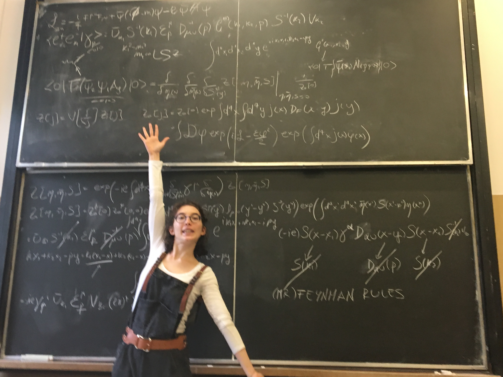

<!--## About this Blog-->

This blog revolves around my actual interests: **creating art, sewing, crocheting, coding, Dungeons and Dragons, Call of Cthulhu** and **Arkham Horror**. Currently it's an **experimental space**, meaning it will undergo continuous changes. The purpose is to document my personal journey with activities I love the most (outside my professional field) and to use it as a tool to consolidate my understanding as I learn new things.
{: style="text-align: justify;"} 

<!--
### What to expect

Here you can anticipate a variety of content:

* **Project Showcases**
* **Step-by-Step tutorials**
* **Reviews on what I like to use to help me in different areas of life from study/chores to gaming**
* **Possible Guest Contributions**
-->

### Why this blog?

I initially started sharing my works on Instagram, but I also wanted to document the process leading to the result, partly for my own benefit and also for those curious minds among you.
{: style="text-align: justify;"}

## Who am I?
<!---
<figure>
    
    <figcaption>Hello this is me!</figcaption>
</figure>
-->

<!--{: .align-left}
*Hello this is me.*
-->

<!--cenrare la caption-->
<figure style="width: 300px" class="align-right">
  
  <figcaption>&uarr; Hello this is me &uarr;</figcaption>
</figure>

I'm Anna. I live in Italy with two adorable cats, Angelina and Penelope. I'm currently pursuing a master's in Physics. If you're wondering, "How does she manage to do all this simultaneously?" rest assured, I can't. I'm all over the place, often forgetting what I did last time and that's precisely why I need this blog (among other reasons). As you may recall from the title of this blog, I love Diana Wynne Jones' books, especially the ones involving Howl. I also enjoy reading comics and watching anime and in my free time I play volleyball (thanks Haikyuu!).
{: style="text-align: justify;"}

You can find me on [Instagram](www.instagram.com/ottyanna/) and [Github](https://github.com/ottyanna).
<!-- non funziano i link-->

For more infos you can visit my first post! <!--TO DO-->

**Happy exploring!** <!-- maybe a link to the Map-->
{: .notice--info}
{: .text-center}